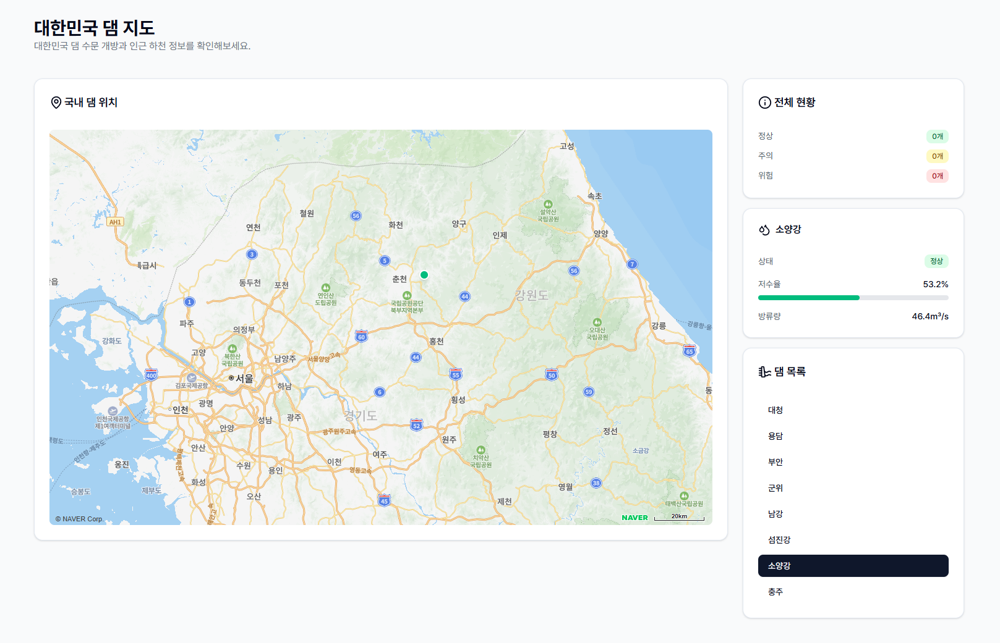

# korea-dam-map (WIP)  [](https://www.codefactor.io/repository/github/skylightqp/korea-dam-map) 

> 대한민국 댐 지도 및 주변 수위 경보

<div align="center">
<br/>

</div>

## 시작하기

- 네이버 지도 사용을 위해 [Ncloud Maps](https://www.ncloud.com/product/applicationservice/maps)에서 API 키를 발급받아야 합니다.
- 국내 다목적 댐 정보를 가져오기 위해 [공공데이터포털](https://www.data.go.kr/data/15099049/openapi.do)에서 API 키를 발급받아야 합니다.

```shell
pnpm install 
```

## 환경변수

- [`.env.example`](./.env.example) 파일을 참고하세요.

| Key                        | Description |
|----------------------------|-------------|
| `NEXT_PUBLIC_NAVER_MAP_CLIENT_KEY` | 네이버 지도 Client Key (브라우저 공개 변수) |
| `OPENAPI_SERVICE_KEY` | 공공데이터포털 OpenAPI Key (Server-Side 변수) |
